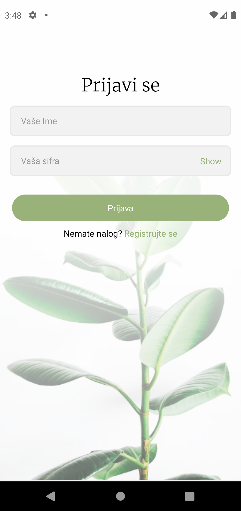
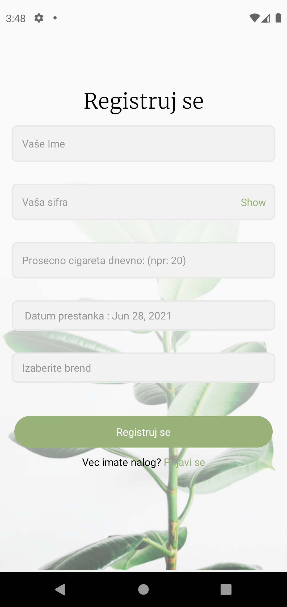
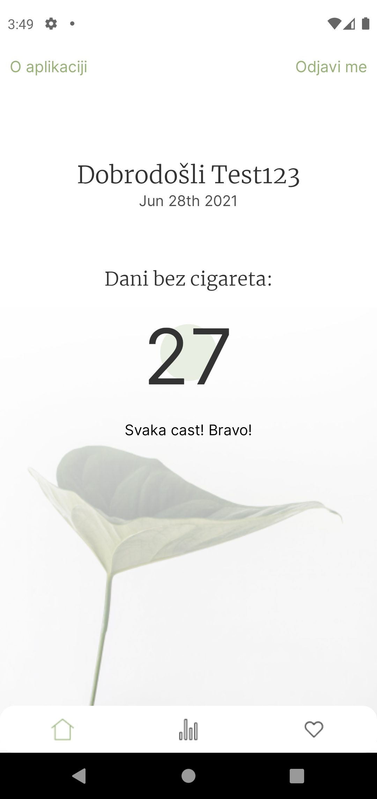
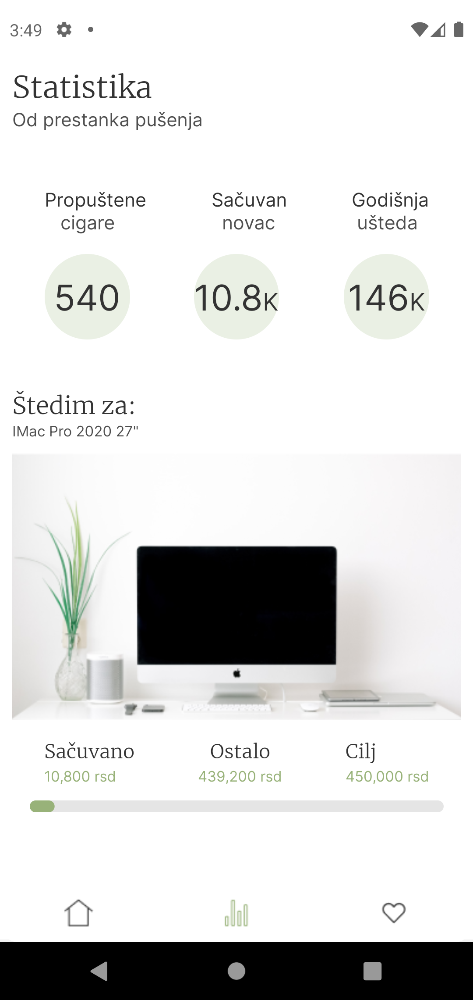
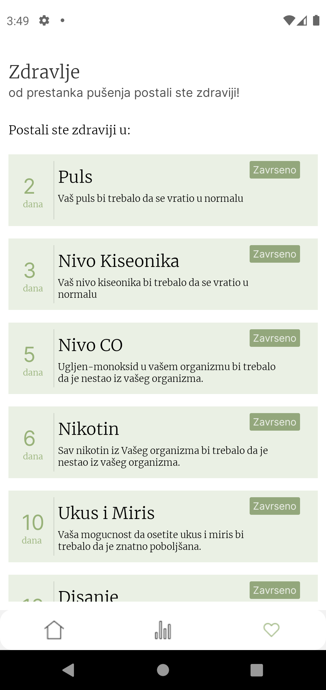
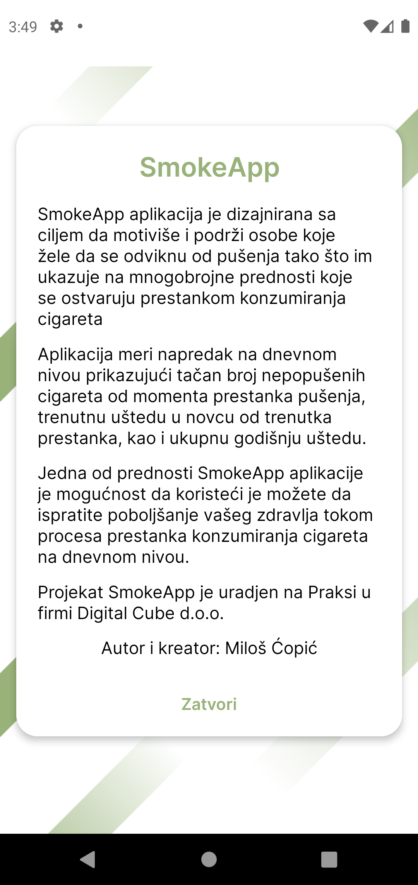

<h1 align="center">SmokeApp - React native application</h1>

Goal of this app is to help people stop smoking

  
   
  <i>Login Screen</i>
   

 

  
   
  <i>Register Screen</i>
   

  
   
  <i>Home Screen shows total number of days without smoking, and also button to sign out and about page.</i>
   

  
   
  <i>Statistics screen is a main page of this application, it shows a number of how much money you saved already, how much you will save annualy, and how much ciggaretes you missed since you stop smoking. Under is a feature that let you create your saving goal, and follow it with progres bar who shows your saved money every day. </i>
   

  
   
  <i>Last screen is Health page and that page follow you with informations about how much your health improved every day since u stoped smoking.</i>
   

  
   
  <i>About page, few words about Application and our goal.</i>
   

